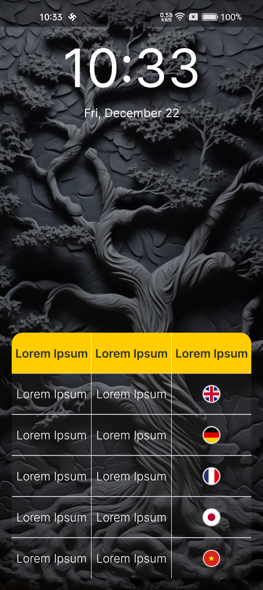
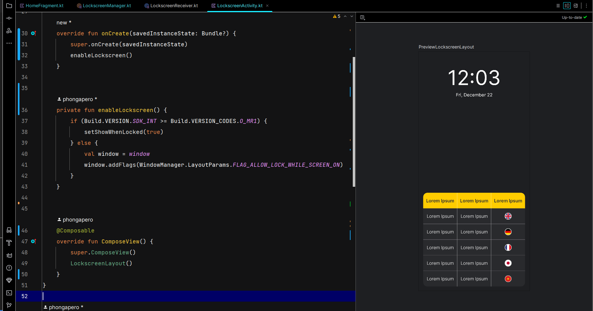

<h1 align="center">Lockscreen-styled Notification<br/>
   Send a notification that looks like as the lockscreen of device
</h1>

<p align="center">
    
</p>


# [**Table Of Content**](#table-of-content)
- [**Table Of Content**](#table-of-content)
- [**Introduction**](#introduction)
- [**Implementation**](#implementation)
  - [**1. Define permissions in Android Manefest**](#1-define-permissions-in-android-manefest)
  - [**2. Define Activity In Android Manifest**](#2-define-activity-in-android-manifest)
  - [**3. Define Special Theme For Activity**](#3-define-special-theme-for-activity)
  - [**4. Establish Alarm Manager To Fire Notifications**](#4-establish-alarm-manager-to-fire-notifications)
    - [**4.1. Create Notification Channel**](#41-create-notification-channel)
    - [**4.2. Configure Alarm Manager to send lockscreen-styled notification**](#42-configure-alarm-manager-to-send-lockscreen-styled-notification)
  - [**5. Defind Lockscreen Receiver**](#5-defind-lockscreen-receiver)
  - [**6. Run code in Home screen**](#6-run-code-in-home-screen)
  - [**7. Write Activity Layout**](#7-write-activity-layout)
- [**Document**](#document)
- [**Post Script**](#post-script)
- [**Made with 💘 and KOTLIN**](#made-with--and-kotlin)

# [**Introduction**](#introduction)

Have you ever seen applications that can send their notification that overrides device's lookscreen?

Perhaps, you are think that it is complicated to impletement this function. Don't worry, because together, we will go into detail to build this function. Generally speaking, it is just sending normal notification and the different is content of the notification. Here is an activity instead of a notification.

<p align="center">
    
</p>
<h3 align="center">

***LOOK LIKE AS DEVICE'S LOCKSCREEN? ACTUALLY, IT IS A NOTIFICATION 😊***
</h3>

# [**Implementation**](#implementation)

## [**1. Define permissions in Android Manefest**](#1-define-permission-in-android)

First of all, to send notifications. We need some run-time permissions to can access system and schedule what content and when we send notifications. There permissions below is all we need to do it

```
<!-- For firing notification on Android 13 -->
<uses-permission android:name="android.permission.POST_NOTIFICATIONS" />
<uses-permission android:name="android.permission.SCHEDULE_EXACT_ALARM" />
<uses-permission android:name="android.permission.USE_EXACT_ALARM" />

<!-- For showing Lockscreen Activity as device's lockscreen -->
<uses-permission android:name="android.permission.USE_FULL_SCREEN_INTENT" />
```

From Android 13 & higher, we need to define `POST_NOTIFICATIONS` permission because in [**Notification runtime permission**](#https://developer.android.com/develop/ui/views/notifications/notification-permission#declare)
, Google has highlighted

> **_NOTE:_**
    We highly recommend that you target Android 13 or higher as soon as possible to benefit from the additional control and flexibility of this feature. If you continue to target 12L (API level 32) or lower, you lose some flexibility with requesting the permission in the context of your app's functionality.
 
To send notifications at 8 am every single day, for instance. I use `Alarm Manager` to schedule in Android system. So that, `SCHEDULE_EXACT_ALARM` & `USE_EXACT_ALARM` are necessary to use this Alarm Manager properly.

## [**2. Define Activity In Android Manifest**](#2-defind-activity-in-android-manifest)

To show an activity that overrides in device's lockscreen. Of course, we have to defind activity in Android Manifest. However, this activiy is special when its background is transparent and only its content is shown so that we need to add some attributes like the following example below

```
<activity
            android:name=".ui.activity.LockscreenActivity"
            android:excludeFromRecents="true"
            android:exported="false"
            android:launchMode="singleInstance"
            android:noHistory="true"
            android:showOnLockScreen="true"
            android:theme="@style/Theme.Lockscreen" />
```

In this activity tag, take a look at `android:launchMode="singleInstance"` because the system doesn't launch any other activities into the task holding the instance. The activity is always the single and only member of its task.

## [**3. Define Special Theme For Activity**](#3-define-special-theme-for-activity)

Last but not least, the theme below is important to apply to the activity. To define, go to `res/values/themes.xml` and copy paste into the `themes.xml` file:

```
<?xml version="1.0" encoding="utf-8"?>
<resources>

    <style name="Theme.Lockscreen" parent="Theme.AppCompat.NoActionBar">
        <item name="android:windowBackground">@android:color/transparent</item>
        <item name="android:colorBackgroundCacheHint">@null</item>
        <item name="android:windowShowWallpaper">true</item>
        <item name="android:windowTranslucentNavigation">true</item>
        <item name="android:windowTranslucentStatus">true</item>
    </style>

</resources>
```

## [**4. Establish Alarm Manager To Fire Notifications**](#4-establish-alarm-manager-to-fire-notifications)
### [**4.1. Create Notification Channel**](#41-create-notification-channel)

```
    /**
     * Note: Create the Notification-Channel, but only on API 26+ because the NotificationChannel
     * class is new and not in the support library
     */
    fun createNotificationChannel(context: Context) {
        //1. define variable
        val name: CharSequence = context.getString(R.string.app_name)
        val description = context.getString(R.string.app_name)
        val importance = NotificationManager.IMPORTANCE_HIGH
        val channel = NotificationChannel(LOCKSCREEN_CHANNEL_ID, name, importance)
        channel.description = description


        //2. Register the channel with the system; you can't change the importance or other notification behaviors after this
        val notificationManager = context.getSystemService(NotificationManager::class.java)
        notificationManager.createNotificationChannel(channel)
    }
```

We have to set importance equals `NotificationManager.IMPORTANCE_HIGH` or `NotificationManager.IMPORTANCE_MAX` to ensure that the lockscreen activity can override device's lockscreen.

If you want to send other normal notifications then create extra notification. Never use the same channel with lockscreen-styled notifications.

You can defile `LOCKSCREEN_CHANNED_ID` and `NOTIFICATION_CHANNED_ID` to send both normal notifications & lockscreen-styled notifications.

### [**4.2. Configure Alarm Manager to send lockscreen-styled notification**](#42-configure-alarm-manager-to-send-lockscreen-styled-notification)

To send lockscreen-styled notification at 08h00 every day. Take the code below as sample

```
    fun setupDailyLockscreenNotification(context: Context) {
        //1. alarm manager sends a lockscreen-styled notification at 4 AM everyday
        val alarmManager = context.getSystemService(Context.ALARM_SERVICE) as AlarmManager
        val alarmTime = Calendar.getInstance()
        val now = Calendar.getInstance()


        alarmTime.timeInMillis = System.currentTimeMillis()
        alarmTime[Calendar.HOUR] = 8
        alarmTime[Calendar.MINUTE] = 0
        alarmTime[Calendar.SECOND] = 10
        if (now.after(alarmTime)) {
            alarmTime.add(Calendar.DATE, 1)
        }


        //2. set up notification at specific time
        val intent = Intent(context, LockscreenReceiver::class.java)
        val pendingIntent = PendingIntent.getBroadcast(context, 100, intent, PendingIntent.FLAG_IMMUTABLE)
        alarmManager.setExact(AlarmManager.RTC_WAKEUP, alarmTime.timeInMillis, pendingIntent)
    }
```

## [**5. Defind Lockscreen Receiver**](#5-defind-lockscreen-receiver)

This lockscreen reveicer works any BroadcastReceiver. Only one thing we need to take note that, we only send the lockscreen-styled when device sleeps or device has locked.


If device is being used by users, we will send a normal notification instead. Below is a good broadcast receiver that you can reference

```
class LockscreenReceiver: BroadcastReceiver() {
    override fun onReceive(context: Context, intent: Intent) {
        /*0. Start repeating notification if the device was shut down and then reboot*/
        if (intent.action == "android.intent.action.BOOT_COMPLETED") {
            LockscreenManager.setupDailyLockscreenNotification(context)
        }


        AppUtil.logcat("BroadcastReceiver: Send lockscreen-styled notification !", tag = "Notification")

        val powerManager = context.getSystemService(PowerManager::class.java)
        val keyguardManager = context.getSystemService(KeyguardManager::class.java)

        if (!powerManager.isInteractive || keyguardManager.isKeyguardLocked) {
            AppUtil.logcat("BroadcastReceiver: popupLockscreenNotification !", tag = "Notification")
            popupLockscreenNotification(context)
        } else {
            AppUtil.logcat("BroadcastReceiver: popupNormalNotification !", tag = "Notification")
            popupNormalNotification(context)
        }


        //4. Set again this alarm manager
        LockscreenManager.setupDailyLockscreenNotification(context)
    }

    /**
     * send a lockscreen-styled notification
     */
    private fun popupLockscreenNotification(context: Context) {
        //1. Create pending
        val lockscreenIntent = Intent(context, LockscreenActivity::class.java)
        lockscreenIntent.setFlags(Intent.FLAG_ACTIVITY_NEW_TASK)
        val lockscreenPendingIntent = PendingIntent.getActivity(context, 0, lockscreenIntent, PendingIntent.FLAG_IMMUTABLE)


        //2. Setup notification builder
        val builder: NotificationCompat.Builder =
            NotificationCompat.Builder(context, LOCKSCREEN_CHANNEL_ID)
                .setSmallIcon(R.drawable.ic_nazi_symbol)
                .setStyle(NotificationCompat.DecoratedCustomViewStyle())
                .setPriority(NotificationCompat.PRIORITY_HIGH)
                .setCategory(NotificationCompat.CATEGORY_CALL)
                .setFullScreenIntent(lockscreenPendingIntent, true)


        //3. Show notification with notificationId which is a unique int for each notification that you must define
        val notificationManager = NotificationManagerCompat.from(context)
        if (ActivityCompat.checkSelfPermission(context, Manifest.permission.POST_NOTIFICATIONS) != PackageManager.PERMISSION_GRANTED) {
            return
        }
        notificationManager.cancel(DEFAULT_LOCKSCREEN_ID)
        notificationManager.notify(DEFAULT_LOCKSCREEN_ID, builder.build())
    }


    /**
     * send a normal notification instead of lockscreen-styled notification
     * */
    private fun popupNormalNotification(context: Context) {
        //2. Create an explicit intent for an Activity in your app
        val destinationIntent = Intent(context, MainActivity::class.java)
        destinationIntent.setFlags(Intent.FLAG_ACTIVITY_NEW_TASK or Intent.FLAG_ACTIVITY_CLEAR_TASK)
        val pendingIntent = PendingIntent.getActivity(
            context,
            1896,
            destinationIntent,
            PendingIntent.FLAG_IMMUTABLE
        )


        //3. define notification builder
        val builder: NotificationCompat.Builder =
            NotificationCompat.Builder(context, LOCKSCREEN_CHANNEL_ID)
                .setSmallIcon(R.drawable.ic_nazi_symbol)
                .setContentTitle(context.getString(R.string.app_name))
                .setContentText(context.getString(R.string.fake_title))
                .setStyle(
                    NotificationCompat.BigTextStyle()
                        .bigText(context.getString(R.string.fake_message))
                )
                .setPriority(NotificationCompat.PRIORITY_DEFAULT)
                .setContentIntent(pendingIntent)
                .setAutoCancel(true)


        //4. Show notification with notificationId which is a unique int for each notification that you must define
        val notificationManager = NotificationManagerCompat.from(context)
        if (ActivityCompat.checkSelfPermission(context, Manifest.permission.POST_NOTIFICATIONS) != PackageManager.PERMISSION_GRANTED) {
            return
        }
        notificationManager.notify(DEFAULT_LOCKSCREEN_ID, builder.build())
    }
}
```

Lastly, don't forget define `Lockscreen Receiver` in Android Manifest

```
    <!-- For Lockscreen Receiver -->
    <receiver
        android:name=".notification.LockscreenReceiver"
        android:enabled="true"
        android:exported="true">
        <intent-filter>
            <action android:name="android.intent.action.MAIN" />
        </intent-filter>
    </receiver>
```


## [**6. Run code in Home screen**](#6-run-code-in-home-screen)

We need to ask users to give us notification run-time permission.

```
    private fun setupNotification() {
        //1. Request POST NOTIFICATION permission if device has Android OS from 13
        if (Build.VERSION.SDK_INT >= Build.VERSION_CODES.TIRAMISU) {
            val isAccessed: Boolean = PermissionUtil.isNotiEnabled(context = requireContext())
            if (!isAccessed) {
                permissionLauncher.launch(Manifest.permission.POST_NOTIFICATIONS)
            }
        }


        //2. Create lockscreen-styled notification and send it every day
        LockscreenManager.createNotificationChannel(context = requireContext())
        LockscreenManager.setupDailyLockscreenNotification(context = requireContext())
    }
```

Before you do, define `ActivityResultLauncher` like below:

```
    @RequiresApi(api = Build.VERSION_CODES.TIRAMISU)
    private val permissionLauncher: ActivityResultLauncher<String> = registerForActivityResult(
        ActivityResultContracts.RequestPermission()
    ) { isAccessed ->
        if (isAccessed) {
            LockscreenManager.setupDailyLockscreenNotification(requireContext())
        } else {
            if (shouldShowRequestPermissionRationale(Manifest.permission.POST_NOTIFICATIONS)) {
                openRationaleDialog()
            } else {
                openSettingDialog()
            }
        }
    }
```

If users reject our request, we should show rationale dialog to expand them why we need these permission. Both 
`openRationaleDialog` and `openSettingDialog` are used for this purpose. You can write yourself if you need, they are optional.

## [**7. Write Activity Layout**](#7-write-activity-layout)

To override our activity to lockscreen, we need run this function as soon as `onCreate` runs

```
     override fun onCreate(savedInstanceState: Bundle?) {
        super.onCreate(savedInstanceState)
        enableLockscreen()
    }

    private fun enableLockscreen() {
        if (Build.VERSION.SDK_INT >= Build.VERSION_CODES.O_MR1) {
            setShowWhenLocked(true)
        } else {
            val window = window
            window.addFlags(WindowManager.LayoutParams.FLAG_ALLOW_LOCK_WHILE_SCREEN_ON)
        }
    }
```

The `enableLockscreen` is answer for the issue that I mention above. Because, this is an activity that you can arrange any content you want.

<p align="center">
    
 
</p>
<h3 align="center">

***A SAMPLE LAYOUT THAT WRITTEN BY JETPACK COMPOSE😊***
</h3>

# [**Document**](#document)

I have pasted package named `notification` to help you do this function easier. You can open this package to see full code 💕💕💕💕.

# [**Post Script**](#post-script)

Probably we are not even living in the same country. We look different. We speak different languages. Maybe we are from entirely different generations. We are just complete strangers.

But there is something that connects us. We both have great taste in getting programming.

Thank you for being here. God bless you, whoever you are ✌️😎

# [**Made with 💘 and KOTLIN**](#made-with-love-and-kotlin)